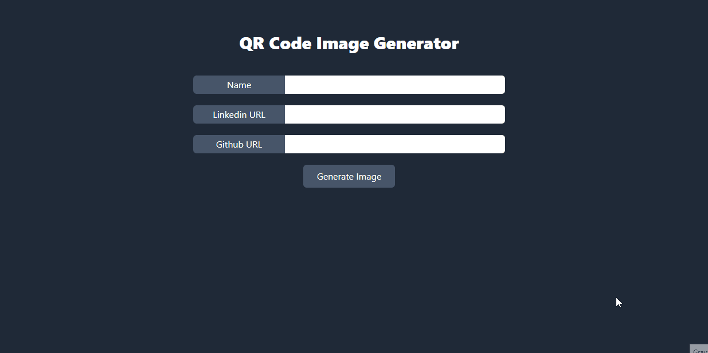

   

  
    

  

# 👨🏽‍💻 Virtual Card

<h4 align="center">🚧 Projeto README 🚀 Em construção... 🚧</h4>

## 🧾 Project Information

**Description:** The project aims to generate a QR Code with all your data on one page.

 

**Technologies used in the project:** <code></code>, <code></code>, <code></code>

## 📱 Project Screens

<code>

</code>

## ✔️ Requirements